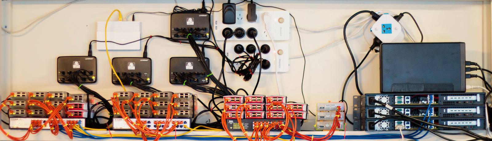
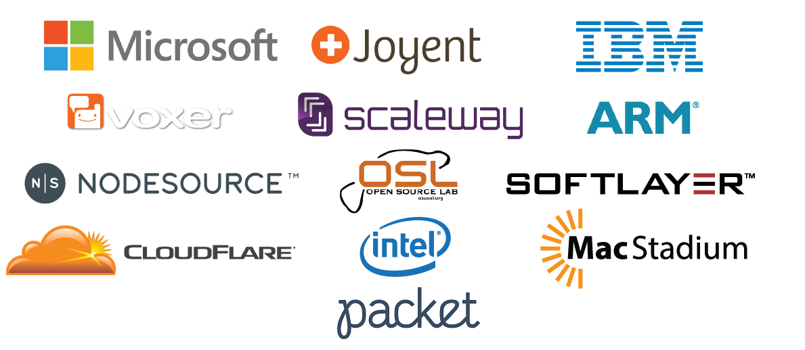

<i><small>Some of the Node.js Build ARM resources: 3
generations of Raspberry Pi and other ARMv7 & ARM64 hardware</small></i>

# Node.js Build Working Group

Chat with us! We use IRC: [#node-build at Freenode][1].

## Purpose

The Node.js Build Working Group maintains and controls infrastructure used for
continuous integration (CI), releases, benchmarks, web hosting
(of [nodejs.org][node] and other Node.js web properties) and more.

Our mission is to provide Node.js Foundation projects with solid computing
infrastructure in order to improve the quality of the software itself by
targeting correctness, speed and compatibility and to ensure streamlined
delivery of binaries and source code to end-users.

This repository contains information used to set up and maintain the various
pieces of Node.js Foundation infrastructure managed by the Build Working Group.
It is intended to be open and transparent, if you see any relevant information
missing please open an issue. If you are interested in joining, please read
[access.md][] to understand the process and reasoning we use for granting access
to the resources we manage.

## Build WG Members

<!-- ncu-team-sync.team(nodejs/build) -->

- [@bnoordhuis](https://github.com/bnoordhuis) - Ben Noordhuis
- [@gdams](https://github.com/gdams) - George Adams
- [@gibfahn](https://github.com/gibfahn) - Gibson Fahnestock
- [@gireeshpunathil](https://github.com/gireeshpunathil) - Gireesh Punathil
- [@jbergstroem](https://github.com/jbergstroem) - Johan Bergström
- [@joaocgreis](https://github.com/joaocgreis) - João Reis
- [@joyeecheung](https://github.com/joyeecheung) - Joyee Cheung
- [@lucalanziani](https://github.com/lucalanziani) - Luca Lanziani
- [@maclover7](https://github.com/maclover7) - Jon Moss
- [@mhdawson](https://github.com/mhdawson) - Michael Dawson
- [@mmarchini](https://github.com/mmarchini) - Matheus Marchini
- [@MylesBorins](https://github.com/MylesBorins) - Myles Borins
- [@phillipj](https://github.com/phillipj) - Phillip Johnsen
- [@refack](https://github.com/refack) - Refael Ackermann
- [@rvagg](https://github.com/rvagg) - Rod Vagg
- [@sam-github](https://github.com/sam-github) - Sam Roberts
- [@Starefossen](https://github.com/Starefossen) - Hans Kristian Flaatten
- [@Trott](https://github.com/Trott) - Rich Trott

<!-- ncu-team-sync end -->

### Infra Admins

- [@gibfahn](https://github.com/gibfahn) - Gibson Fahnestock
- [@jbergstroem](https://github.com/jbergstroem) - Johan Bergström
- [@joaocgreis](https://github.com/joaocgreis) - João Reis
- [@mhdawson](https://github.com/mhdawson) - Michael Dawson
- [@rvagg](https://github.com/rvagg) - Rod Vagg

### Release Admins

- [@gibfahn](https://github.com/gibfahn) - Gibson Fahnestock
- [@jbergstroem](https://github.com/jbergstroem) - Johan Bergström
- [@joaocgreis](https://github.com/joaocgreis) - João Reis
- [@rvagg](https://github.com/rvagg) - Rod Vagg

### GitHub Bot Admins

<!-- ncu-team-sync.team(nodejs/github-bot) -->

- [@Fishrock123](https://github.com/Fishrock123) - Jeremiah Senkpiel
- [@jbergstroem](https://github.com/jbergstroem) - Johan Bergström
- [@joyeecheung](https://github.com/joyeecheung) - Joyee Cheung
- [@maclover7](https://github.com/maclover7) - Jon Moss
- [@mscdex](https://github.com/mscdex) - mscdex
- [@phillipj](https://github.com/phillipj) - Phillip Johnsen
- [@Starefossen](https://github.com/Starefossen) - Hans Kristian Flaatten
- [@williamkapke](https://github.com/williamkapke) - William Kapke

<!-- ncu-team-sync end -->

If you are interested in joining the Build WG, or for more information about
accesses and team roles see [access.md][].

## Infrastructure Providers

The Node.js Foundation is proud to receive contributions from many companies,
both in the form of monetary contributions in exchange for membership or
in-kind contributions for required resources. The Build Working Group
collaborates with the following companies who contribute various kinds of
cloud and physical hardware to the Node.js project.

### Tier-1 Providers

The Node.js Foundation's tier-1 infrastructure providers contribute the largest
share of infrastructure to the Node.js project. Without these companies,
the project would not be able to provide the quality, speed and availability of
test coverage that it does today.

- **[DigitalOcean][2]**: a popular cloud hosting service, provides a
  significant amount of the resources required to run the Node.js project
  including key CI infrastructure/servers required to host [nodejs.org][node].

- **[Rackspace][3]**: a popular managed cloud company, provides significant
  resources used to power much of the Node.js project's CI system, including
  key Windows compilation servers, along with additional services such as
  [Mailgun][5] for some [nodejs.org and iojs.org email][6] services.

### Tier-2 Providers

The Node.js Foundation's tier-2 infrastructure providers fill essential gaps
in architecture and operating system variations and shoulder some of the burden
from the tier-1 providers, contributing to availability
and speed in our CI system.

- **[Microsoft][7]**: Provides Windows-related test infrastructure
  on [Azure][8] for the Node.js CI system.

- **[Joyent][9]**: A private cloud infrastructure company, provides SmartOS
  and other test/build resources for the Node.js CI system, resources for
  backup of our critical infrastructure, redundancy for nodejs.org and or
  [unencrypted.nodejs.org](http://unencrypted.nodejs.org) mirror.

- **[IBM][10]**:
  - [IBM Cloud][11] provides hardware for testing and benchmarking for the
    Node.js project's CI system.
  - Via the [Oregon State University Open Source Lab][12], provides
    PPC-based test and build infrastructure.
  - Via the [IBM LinuxOne(TM) Community Cloud][13], provides linuxOne
    based test and build infrastructure.

- **[Scaleway][15]**: Scalable cloud platform designed for developers &
  growing companies, contributes key ARMv7 hardware for test and release
  builds for the Node.js CI system.

- **[Cloudflare][16]**: CDN and internet traffic management
  provider, are responsible for providing fast and always-available
  access to [nodejs.org][node].

- **[ARM][17]**: Semiconductor intellectual property supplier, have donated
  ARMv8 / ARM64 hardware used by the Node.js CI system for build and testing
  Node.js.

- **[Intel][22]**: "The world leader in silicon innovation," contributes
  hardware used for benchmarking in the Node.js project's CI system to advance
  and accelerate Node.js performance.

- **[MacStadium][23]**: Managed hosting provider for Mac. Provides Mac
  hardware used for testing in the Node.js project's CI system.

- **[Packet][24]**: Bare metal cloud for developers. Through their
  [Works on Arm](https://www.worksonarm.com/), Packet provides ARM64 build
  infrastructure and additional resources for powering our CI system.

### Community Donations

From time to time, the Node.js Build Working group calls for, and receives
donations of hardware in order to expand the breadth of the build and test
infrastructure it maintains.

The Node.js Foundation would like to thank the following individuals and
companies that have donated miscellaneous hardware:

- [NodeSource][ns] for a Raspberry Pi B, a Raspberry Pi B+,
  a Raspberry Pi 2 B and an ODROID-XU3
- Andrew Chilton [@chilts](https://github.com/chilts) for a Raspberry Pi B
- Julian Duque [@julianduque](https://github.com/julianduque)
  for a Beaglebone Black
- Andi Neck [@andineck](https://github.com/andineck)
  for 2 x Raspberry Pi B+
- Bryan English [@bengl](https://github.com/bengl) for 2 x Raspberry Pi B+
- Continuation Labs [@continuationlabs](https://github.com/continuationlabs)
  for a Raspberry Pi B+
- C J Silverio [@ceejbot](https://github.com/ceejbot) for a Raspberry Pi B+
  and a Raspberry Pi 2 B
- [miniNodes][18] for a Raspberry Pi B+ and
  a Raspberry Pi 2 B
- Simeon Vincent [@svincent](https://github.com/svincent) for
  3 x Raspberry Pi 2 B
- Joey van Dijk [@joeyvandijk](https://github.com/joeyvandijk) and
  [Techtribe][19] for 2 x Raspberry Pi 2 B and an ODROID-U3+
- Matteo Collina [@mcollina](https://github.com/mcollina) for a Raspberry Pi 2 B
- Sam Thompson [@sambthompson](https://github.com/sambthompson) for a
  Raspberry Pi 2 B
- Louis Center [@louiscntr](https://github.com/louiscntr) for a Raspberry Pi 2 B
- Dav Glass [@davglass](https://github.com/davglass/) for 2 x ODROID-XU3, Raspberry Pi 1 B+, Raspberry Pi 3, power, networking and other miscellaneous equipment
- [Tessel][20] for a Tessel 2
- KahWee Teng [@kahwee](https://github.com/kahwee) for a Raspberry Pi 3
- Chinmay Pendharkar [@notthetup](https://github.com/notthetup) and Sayanee Basu [@sayanee](https://github.com/sayanee) for a Raspberry Pi 3
- Michele Capra [@piccoloaiutante](https://github.com/piccoloaiutante) for a Raspberry Pi 3
- [Pivotal Agency][pivotal] for two Raspberry Pi 3's
- [SecuroGroup][securo] for two Raspberry Pi 1 B+'s and two Raspberry Pi 3's
- William Kapke [@williamkapke](https://github.com/williamkapke) for three Raspberry Pi 3's and networking equipment
- Jonathan Barnett [@indieisaconcept](https://github.com/indieisaconcept) for a Raspberry Pi B+
- James Snell [@jasnell](https://github.com/jasnell) for a Raspberry Pi 2
- Michael Dawson [@mhdawson](https://github.com/mhdawson) for a Raspberry Pi 1 B+
- Chris Lea [@chrislea](https://github.com/chrislea) for a Raspberry Pi 1 B+

If you would like to donate hardware to the Node.js Foundation, please
reach out to the Build Working Group, via IRC (details at the top of this page)
or contact [Rod Vagg](mailto:rod@vagg.org) directly. The Build Working Group
reserves the right to choose what hardware is actively used and how it is used,
donating hardware does not guarantee its use within the testing infrastructure
as there are many other factors that must be considered. Some donated hardware,
while not used actively in the CI infrastructure, is used from time to time for
R&D purposes by the project.

## CI Software

Build and test orchestration is performed by [Jenkins][21].

- A summary of build and test jobs can be found at: <https://ci.nodejs.org>
- A listing of connected servers for testing, building and benchmarking
  can be found at: <https://ci.nodejs.org/computer/>

The Build WG will keep build configuration required for a release line for 6
months after the release goes End-of-Life, in case further build or test runs
are required. After that the configuration will be removed.

[1]:    irc://irc.freenode.net/node-build
[2]:    https://digitalocean.com/
[3]:    https://www.rackspace.com/
[5]:    https://www.mailgun.com/
[6]:    https://github.com/nodejs/email
[7]:    https://www.microsoft.com/
[8]:    https://azure.microsoft.com
[9]:    https://www.joyent.com/
[10]:   https://www.ibm.com/
[11]:   https://www.ibm.com/cloud
[12]:   https://osuosl.org/services/powerdev
[13]:   https://developer.ibm.com/linuxone/
[15]:   https://www.scaleway.com/
[16]:   https://www.cloudflare.com/
[17]:   https://www.arm.com/
[18]:   https://www.mininodes.com/
[19]:   http://techtribe.nl
[20]:   https://tessel.io/
[21]:   https://jenkins.io/
[22]:   https://www.intel.com/
[23]:   https://www.macstadium.com/
[24]:   https://www.packet.net/
[access.md]: ./doc/access.md
[node]: https://nodejs.org/
[ns]:   https://nodesource.com/
[pivotal]: https://www.pivotalagency.com.au/
[securo]: http://securogroup.com/
