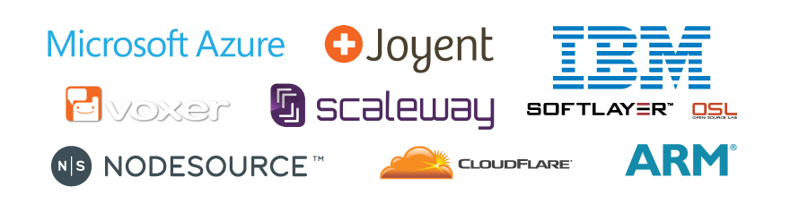

Node.js Build Working Group
===========================

Chat with us! We use IRC: [#node-build at Freenode](irc://irc.freenode.net/node-build)

Purpose
-------

The Node.js Build Working Group maintains and controls infrastructure used for continuous integration (CI), releases, benchmarks, web hosting (of [nodejs.org](https://nodejs.org/) and other Node.js web properties) and more.

Our mission is to provide Node.js Foundation projects with solid computing infrastructure in order to improve the quality of the software itself by targeting correctness, speed and compatibility and to ensure streamlined delivery of binaries and source code to end-users.

This repository contains information used to set up and maintain the various pieces of Node.js Foundation infrastructure managed by the Build Working Group. It is intended to be open and transparent, if you see any relevant information missing please open an issue.

Infrastructure Providers
------------------------

The Node.js Foundation is proud to receive contributions from many companies, both in the form of monetary contributions in exchange for membership or in-kind contributions for required resources. The Build Working Group collaborates with the following companies who contribute various kinds of cloud and physical hardware to the Node.js project.

### Tier-1 Providers

The Node.js Foundation's tier-1 infrastructure providers contribute the largest share of infrastructure to the Node.js project. Without these companies, the project would not be able to provide the quality, speed and availability of test coverage that it does today.

**[DigitalOcean](http://digitalocean.com/)**, a popular cloud hosting service, provides a significant amount of the resources required to run the Node.js project including key CI infrastructure and servers required to host [nodejs.org](https://nodejs.org/).

**[Rackspace](https://www.rackspace.com/)**, a popular managed cloud company, provides significant resources used to power much of the Node.js project's CI system, including key Windows compilation servers, along with additional services such as object storage for backups via [Cloud Files](http://www.rackspace.com/en-au/cloud/files) and [Mailgun](http://www.mailgun.com/) for some [nodejs.org email](https://github.com/nodejs/email) services.

### Tier-2 Providers

The Node.js Foundation's tier-2 infrastructure providers fill essential gaps in architecture and operating system variations and shoulder some of the burden from the tier-1 providers, contributing to availability and speed in our CI system.

**[Microsoft](https://www.microsoft.com/)** provides Windows-related test infrastructure on [Azure](https://azure.microsoft.com) for the Node.js CI system.

**[Joyent](https://www.joyent.com/)**, a public/private cloud infrastructure company, provides SmartOS and other test and build resources for the Node.js CI system.

**[IBM](https://www.ibm.com/)**:
  * Via their cloud company, [SoftLayer](https://www.softlayer.com/), provides hardware for testing and benchmarking for the Node.js project's CI system.
  * Via the [Oregon State University Open Source Lab](https://osuosl.org/services/powerdev), provides PPC-based test and build infrastructure.
  * Via the [IBM LinuxOne(TM) Community Cloud](https://developer.ibm.com/linuxone/), provides linuxOne based test and build infrastructure.

**[Voxer](https://voxer.com/)**, a voice, text, photo and video messaging service and well-known Node.js early-adopter donated and host OS X hardware for building and testing via the Node.js project's CI
system.

**[Scaleway](https://www.scaleway.com/)**, a "BareMetal" SSD cloud server provider, contributes key ARMv7 hardware for test and build for the Node.js CI system.

**[NodeSource](https://nodesource.com/)**, a Node.js enterprise products and services company, donates hardware and hosting for most of the Node.js project's ARM test and build infrastructure.

**[CloudFlare](https://www.cloudflare.com/)**, a CDN and internet traffic management provider, are responsible for providing fast and always-available access to [nodejs.org](https://nodejs.org).

**[ARM](https://www.arm.com/)**, semiconductor intellectual property supplier, have donated ARMv8 hardware for use by the Node.js CI system for build and testing Node.js.

### Community Donations

From time to time, the Node.js Build Working group calls for, and receives donations of hardware in order to expand the breadth of the build and test infrastructure it maintains.

The Node.js Foundation would like to thank the following individuals and companies that have donated miscellaneous hardware:

* NodeSource <https://nodesource.com/> for a Raspberry Pi B, a Raspberry Pi B+, a Raspberry Pi 2 B and an ODROID-XU3
* Andrew Chilton [@chilts](https://github.com/chilts) for a Raspberry Pi B
* Julian Duque [@julianduque](https://github.com/julianduque) for a Beaglebone Black
* Andi Neck [@andineck](https://github.com/andineck) for 2 x Raspberry Pi B+
* Bryan English [@bengl](https://github.com/bengl) for 2 x Raspberry Pi B+
* Continuation Labs [@continuationlabs](https://github.com/continuationlabs) for a Raspberry Pi B+
* C J Silverio [@ceejbot](https://github.com/ceejbot) for a Raspberry Pi B+ and a Raspberry Pi 2 B
* miniNodes <https://www.mininodes.com/> for a Raspberry Pi B+ and a Raspberry Pi 2 B
* Simeon Vincent [@svincent](https://github.com/svincent) for 3 x Raspberry Pi 2 B
* Joey van Dijk [@joeyvandijk](https://github.com/joeyvandijk) and <http://techtribe.nl> for 2 x Raspberry Pi 2 B and an ODROID-U3+
* Matteo Collina [@mcollina](https://github.com/mcollina) for a Raspberry Pi 2 B
* Sam Thompson [@sambthompson](https://github.com/sambthompson) for a Raspberry Pi 2 B
* Louis Center [@louiscntr](https://github.com/louiscntr) for a Raspberry Pi 2 B
* Dav Glass [@davglass](https://github.com/davglass/) for 2 x ODROID-XU3
* Tessel <https://tessel.io/> for a Tessel 2

If you would like to donate hardware to the Node.js Foundation, please reach out to the Build Working Group, via IRC (details at the top of this page) or contact [Rod Vagg](mailto:rod@vagg.org) directly. The Build Working Group reserves the right to choose what hardware is actively used and how it is used, donating hardware does not guarantee its use within the testing infrastructure as there are many other factors that must be considered. Some donated hardware, while not used actively in the CI infrastructure, is used from time to time for R&D purposes by the project.

CI Software
-----------

Build and test orchestration is performed by [Jenkins](http://jenkins-ci.org).

* A summary of build and test jobs can be found at: <https://ci.nodejs.org>
* A listing of connected servers for testing, building and benchmarking can be found at: <http://ci.nodejs.org/computer/>

People
------

* Wyatt Preul [@geek](https://github.com/geek)
* Johan Bergström [@jbergstroem](https://github.com/jbergstroem)
* João Reis [@joaocgreis](https://github.com/joaocgreis)
* Michael Dawson [@mhdawson](https://github.com/mhdawson)
* Phillip Johnsen [@phillipj](https://github.com/phillipj)
* Rod Vagg [@rvagg](https://github.com/rvagg)
* Hans Kristian Flaatten [@Starefossen](https://github.com/Starefossen)
* Myles Borins [@thealphanerd](https://github.com/thealphanerd)
* Rich Trott [@trott](https://github.com/trott)
