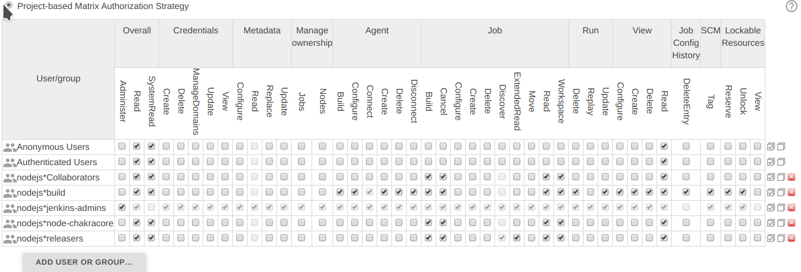
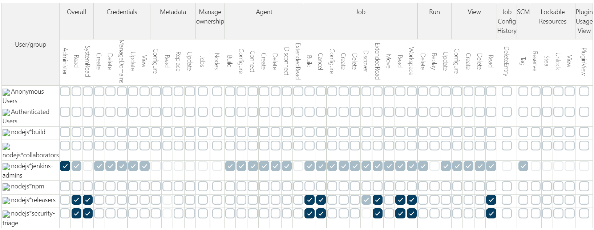

# Jenkins Guide

A guide on maintaining Node.js' Test and Release Jenkins clusters

## TOC

* [Ansible](#ansible)
  * [Running playbooks](#running-playbooks)
* [Security releases](#security-releases)
  * [Before the release](#before-the-release)
    * [Annouce the pending CI lock down](#announce-the-pending-ci-lock-down)
    * [Lock down the CI](#lock-down-the-ci)
  * [After the release](#after-the-release)
* [Solving problems](#solving-problems)
  * [Out of memory](#out-of-memory)
  * [Out of space](#out-of-space)
    * [AIX Space Issues](#AIX-Space-Issues)
  * [General issues with Jenkins agent: "normal machines" edition](#general-issues-with-jenkins-agent-normal-machines-edition)
  * [Read-only filesystem](#read-only-filesystem)
  * [Restart the machine](#restart-the-machine)
  * [Fixing machines with Docker](#fixing-machines-with-docker)
  * [Windows](#windows)
  * [IDK what to do](#idk-what-to-do)


## Ansible

All machines in the clusters are managed using Ansible, with the
playbooks that live in `ansible/playbooks/jenkins`.

The playbooks provision a machine, and handle tasks such as installing
compilers, Java versions, and managing the local Jenkins agent.

To see which playbooks correspond to which worker, check the [services
document](./services.md).

### Running playbooks

Before running playbooks, ensure that you have the [secrets repo][secrets repo] properly
cloned and found by Ansible, [as described in the README](../ansible/README.md).
If the machine secret is not available, you can always get it from the
machine's Jenkins configuration page.

You can now run the playbook for the machine. Since
`test-rackspace-freebsd10-x64-1` is being used for this example, you would want
to run the following command on your local machine, from within the `ansible`
directory:

```bash
ansible-playbook playbooks/jenkins/worker/create.yml --limit test-rackspace-freebsd10-x64-1
```

If all goes according to plan, then Ansible should be able to run the
playbook with no errors. If you do encounter problems, there are usually
some WG members available in the
[Node.js Build Slack channel][], who can try and
lend a hand.

## Security releases

When security releases are due to go out, the Build WG plays an
important role in facilitating their testing.

### Before the release

The [public CI](https://ci.nodejs.org) must be "locked down" to prevent anyone
from interfering in the testing of the release. This is usually done 24 hours
before a release is due to be published, but may be earlier depending on the
planned contents of the release. If in doubt check with the [steward for the
security release](https://github.com/nodejs/node/blob/main/doc/contributing/security-release-process.md#security-release-stewards).

A tracking issue in the [`nodejs/build` issue tracker](https://github.com/nodejs/build/issues)
should have been created by the security release steward requesting Build WG
members to be available to support the security release.

#### Announce the pending CI lock down

Make a post in the `nodejs/collaborators` [discussion page](https://github.com/nodejs/collaborators/discussions/categories/announcements)
to let users of the public CI know that their access will be curtailed. Pin
the discussion post so that it appears at the top of the page.
Be sure to insert a link to the `nodejs/build` tracking issue.

e.g.
```text
CI to be locked down from <date> for upcoming security release

To support the upcoming security release, the public CI will be locked down
from <date> and access restricted to it until the releases are released.

Refs: <link to tracking issue>
```

Also post advance notice to the [#nodejs-core Slack channel](https://openjs-foundation.slack.com/archives/C019Y2T6STH),
referencing the discussion post.

#### Lock down the CI

You must be a member of the `nodejs/jenkins-admins` team to have the necessary
permissions to lock down the CI.

Add a system message to Jenkins by going to https://ci.nodejs.org/manage/appearance
and under "Customizable Header" click the "+ Add System message" button. In the
"Message" field that is created, enter something like:

```html
<h1 style="color:red">system is under embargo for a security release</h1>
<h2>For solidarity, even if you have access, please don't start unrelated jobs</h2>
<p>Refs: <a href="https://github.com/nodejs/build/issues/xxx">https://github.com/nodejs/build/issues/xxx</a></p>
```

Unselect "Dismissible" and change the "Background of System Message" to
"Warning".


To make it more obvious that the CI has been locked down, add some "Extra CSS"
to https://ci.nodejs.org/manage/appearance.
This should already exist but commented out like this:
```css
/* Uncomment for security releases */
/*
#page-header, .task-icon-link[href="/"] {
  background-color: red;
}
a#jenkins-home-link:after {
  content: "Under security embargo!";
  font-size: larger;
  color: yellow;
  margin-left: 250px;
}
/* */
```

Uncomment by adding `*/` before the `#page-header` line:
```css
/* Uncomment for security releases */
/* */
#page-header, .task-icon-link[href="/"] {
  background-color: red;
}
a#jenkins-home-link:after {
  content: "Under security embargo!";
  font-size: larger;
  color: yellow;
  margin-left: 250px;
}
/* */
```

To change the Jenkins security configuration, travel to the ["Configure Global
Security"](https://ci.nodejs.org/configureSecurity/) page.

Below is a screenshot of what the "Project-based Matrix Authorization Strategy"
table should look like before the release testing:



***Note: the Jenkins UI changes occasionally, as does the permissions. Make a
screenshot of the "before" state if it does not exactly match the documented
screenshot (and update the documented screenshot).***

Below is a screenshot of what the table should look like while release
testing is underway:



### After the release

After the release has gone out, restore the table to its original
condition. Add a comment to your post in `nodejs/collaborators` and the
tracking issue in `nodejs/build` to announce that access has been
restored.

The process of restoring permissions involves adding back the groups that are no
longer displayed (because they had no permissions), and setting the permissions
to those shown above ("before the release testing").

The history audit log may be helpful, but there is no way to revert to an
earlier configuration.

Relevant logs:
1. system (includes security matrix) - https://ci.nodejs.org/jobConfigHistory/history?name=config
2. CSS - https://ci.nodejs.org/jobConfigHistory/history?name=org.codefirst.SimpleThemeDecorator

Undo the "system message" changes and "Extra CSS" theme changes from https://ci.nodejs.org/manage/appearance.

## Solving problems

Issues with the Jenkins clusters are usually reported to either the
[Node.js Build Slack channel][], or to the
[`nodejs/build` issue tracker](https://github.com/nodejs/build/issues).

When trying to fix a worker, ensure that you `mark the node as offline`,
via the Jenkins worker configure UI, so more failures don't pile up.
Once you are done fixing the worker, ensure that you return the worker
to the "online" status.

The most common issues facing workers are explained below, with potential
solutions on how to remedy the problem. Most commands below are meant to
be run on the worker itself, after SSH-ing in and switching to the
`iojs` user. See the [SSH guide](./ssh.md) on how to log into the machines.

### Out of memory

First, get statistics on running processes for the machine: `ps aux | grep node`.

If there are a lot of "hanging" / "abandoned" processes, it's best to
remove them by running a command like: `ps -ef | grep node | grep -v -egrep -ejava -edocker | awk '{print $2}' | xargs kill`.

Overall memory utilization can be found using the `free` command on most
workers, or the `swap -s -h` command on SmartOS workers.

### Out of space

First, get statistics on how full (or not) the machine is by running the
`df -h` command.

If the `Use%` column appears very high for the worker's largest disk,
then it is probably appropriate to clean out part of the worker's
workspace (where Jenkins jobs are performed). To clean out part of the
workspace, run `rm -rf ~/build/workspace/node-test-commit*`.

#### AIX Space Issues

The AIX machines are often under provisoned in terms of how much diskspace they have.
You can just increase the size of mount points themselves.

To check space run `df -g`

```sh
$ df -g
Filesystem    GB blocks      Free %Used    Iused %Iused Mounted on
/dev/hd4           0.09      0.06   41%     2543    16% /
/dev/hd2           6.12      4.25   31%    38189     4% /usr
/dev/hd9var        5.19      4.75    9%     1254     1% /var
/dev/hd3           4.22      4.21    1%       42     1% /tmp
/dev/hd1          20.03     17.73   12%    44911     2% /home
/dev/hd11admin      0.12      0.12    1%        5     1% /admin
/proc                 -         -    -        -      - /proc
/dev/hd10opt      10.41      8.77   16%    24532     2% /opt
/dev/livedump      0.25      0.25    1%        4     1% /var/adm/ras/livedump
/dev/repo00        8.41      0.01  100%     2656    42% /usr/sys/inst.images
```

To check the amount of space left on the volume group:

Find the volume group `lsvg`

List information about the volume group `lsvg rootvg`

Check the amount of `FREE PPs` to see how much space is left on the volume group:
```bash
VOLUME GROUP:       rootvg                   VG IDENTIFIER:  00f6db0a00004c000000016fe89cbde6
VG STATE:           active                   PP SIZE:        32 megabyte(s)
VG PERMISSION:      read/write               TOTAL PPs:      3838 (122816 megabytes)
MAX LVs:            256                      FREE PPs:       2033 (65056 megabytes) *HERE*
LVs:                13                       USED PPs:       1805 (57760 megabytes)
OPEN LVs:           12                       QUORUM:         2 (Enabled)
TOTAL PVs:          2                        VG DESCRIPTORS: 3
STALE PVs:          0                        STALE PPs:      0
ACTIVE PVs:         2                        AUTO ON:        yes
MAX PPs per VG:     32512
MAX PPs per PV:     16256                    MAX PVs:        2
LTG size (Dynamic): 512 kilobyte(s)          AUTO SYNC:      no
HOT SPARE:          no                       BB POLICY:      relocatable
PV RESTRICTION:     none                     INFINITE RETRY: no
DISK BLOCK SIZE:    512                      CRITICAL VG:    no
FS SYNC OPTION:     no
```

To increase the size of `/home` run: `sudo chfs -a size=+XG /home` where X is the number of GBs to increase the system.

If you hit an error about the maximum allocation of the logical volume you can increase the max with: 
`sudo chlv -x <size> <logical volume>`

*If you are unsure about any of the commands please ask a Red Hat/IBM member of the build working group for assistance*

### General issues with Jenkins agent: "normal machines" edition

Git errors or exceptions raised by the Jenkins agent can usually be
fixed by taking a look at the agent's logs, and then restarting it.

To view the agent's logs on most modern Linux machines, you can run
`journalctl -n 50 -u jenkins | less`.

To view the status of the agent, you can run one of the following
commands (based on the OS of the worker):

```bash
# Most modern Linux machines
systemctl status jenkins

# Older Linux machines
service jenkins status

# SmartOS
svcs -l svc:/application/jenkins:default

# macOS
sudo launchctl list | grep jenkins

# Other OSes
~iojs/start.sh
```

To restart the agent, you can run one of the following commands (based
on the OS of the worker):

```bash
# Most modern Linux machines
systemctl restart jenkins

# Older Linux machines
service jenkins restart

# SmartOS
svcadm restart svc:/application/jenkins:default

# macOS
launchctl stop org.nodejs.osx.jenkins
launchctl start org.nodejs.osx.jenkins

# AIX
sudo /etc/rc.d/rc2.d/S20jenkins start

# Other OSes
~iojs/start.sh
```

### Read-only filesystem

Sometimes a failure in the filesystem will cause it to enter a read-only state.
If that happens, follow the steps below:

```bash
touch foo                      # to confirm system is read-only, don't proceed if this succeeds
sudo df                        # to determine the device for `/`
sudo e2fsck -y /dev/mmcblk0p2  # replace mmcblk0p2 with proper device for `/`
```

After running the steps above, follow instructions below to 
[restart the machine](#restart-the-machine).

Note: the occurrence of read-only root filesystem indicates there's probably a
more concerning issue going on. Remember to open an issue on nodejs/build to 
investigate further, as it might be required to reprovision the machine.

### Restart the machine

Sometimes something weird happens, and it's easier to just reboot the
worker.

On Unix just do one of:

```bash
shutdown -r now
# or:
reboot
```

On the advice of the system adminstrators managing the AIX machines, please do
not restart them without good reason, it will make things worse. It may help to
run the https://ci.nodejs.org/job/aix-cleanup/ to kill any stray processes from
earlier failed job runs.

### Fixing machines with Docker

The above steps generally do not apply to workers that are either
"Half Docker" or "Full Docker".

Below is a quick guide using [`test-softlayer-ubuntu1804_container-x64-1`][1] as an example Jenkins worker.

1. Figure out the which machine hosts the container. It should be stated in
the [worker's view][1] on Jenkins
2. Verify the existence of the container:
    * To view a list of all active Docker containers, you can run: `docker ps`
    * To view a list of all active services, you can run:  
      ```bash
      systemctl list-units | grep jenkins
      ```
    * Each container should have a matching `systemd` service that starts and stops the
    container. Its name should be `jenkins-${workername}`, so in this example
      ```
      jenkins-test-softlayer-ubuntu1804_container-x64-1
      ```
3. To view the logs for a service run:
   ```
   journalctl -u jenkins-test-softlayer-ubuntu1804_container-x64-1
   ```
4. To restart a Docker container, restart the associated `systemd` service:
   ```
   systemctl restart jenkins-test-softlayer-ubuntu1804_container-x64-1
   ```
5. `CONTAINER ID` is needed to console into a Docker container, first run:
   ```
   docker ps -f "name=test-softlayer-ubuntu1804_container-x64-1"
   ```
   That will give you:
   ```
   CONTAINER ID        IMAGE                                               COMMAND                  CREATED             STATUS              PORTS               NAMES
   9f3272e43017        node-ci:test-softlayer-ubuntu1804_container-x64-1   "/bin/sh -c 'cd /hom…"   19 minutes ago      Up 19 minutes                           node-ci-test-softlayer-ubuntu1804_container-x64-1
   ```
   then using run the following, replacing `CONTAINER_ID` with the appropriate ID
   ```
   docker exec -it ${CONTAINER_ID} /bin/bash`
   ```

### Windows

On Windows, it might or might not help but should be harmless to run
https://ci.nodejs.org/view/All/job/git-clean-windows/ and
https://ci.nodejs.org/view/All/job/windows-update-reboot/ with force
reboot.

### IDK what to do

In case the above steps did not work, or you are unsure of what to try,
this section is for you.

The first thing to remember is that, ultimately, all workers can be
replaced with newly provisioned ones, so don't worry too much about
messing up a worker.

The safest bet when dealing with an erroring worker is to re-run its
associated Ansible playbook. This will try and restore the worker back
to its desired state, including refreshing and restarting the Jenkins
agent configuration.

If none of the above steps work, please post in the
[Node.js Build Slack channel][], or the
[`nodejs/build` issue tracker](https://github.com/nodejs/build/issues), to allow
for escalation and other WG members to troubleshoot.

For problems with machines outside of the Jenkins test cluster, ask one
of the members of the [infra](https://github.com/nodejs/build#infra-admins) or
[release](https://github.com/nodejs/build#release-admins) administrators to
take a look.

[secrets repo]: https://github.com/nodejs-private/secrets
[ci]: https://ci.nodejs.org/computer/test-softlayer-ubuntu1804_container-x64-1/
[1]: https://ci.nodejs.org/computer/test-softlayer-ubuntu1804_container-x64-1/
[Node.js Build Slack channel]: https://openjs-foundation.slack.com/archives/C03BJP63CH0
