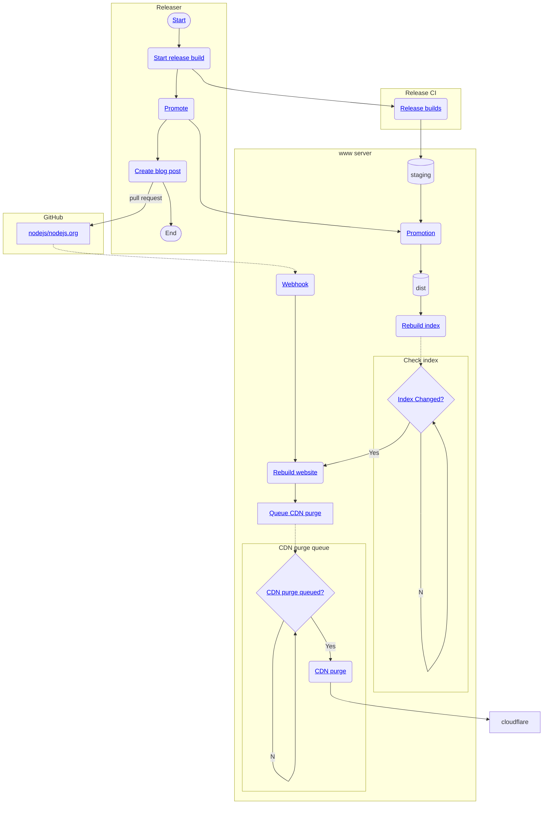

# Overview of release process and infrastructure for Node.js

This is an overview of how the release process for Node.js works and how it interacts with Build WG infrastructure.
Clicking on most labels will take you to the relvevant area of the build repository or other repository owned by the Node.js organization.

