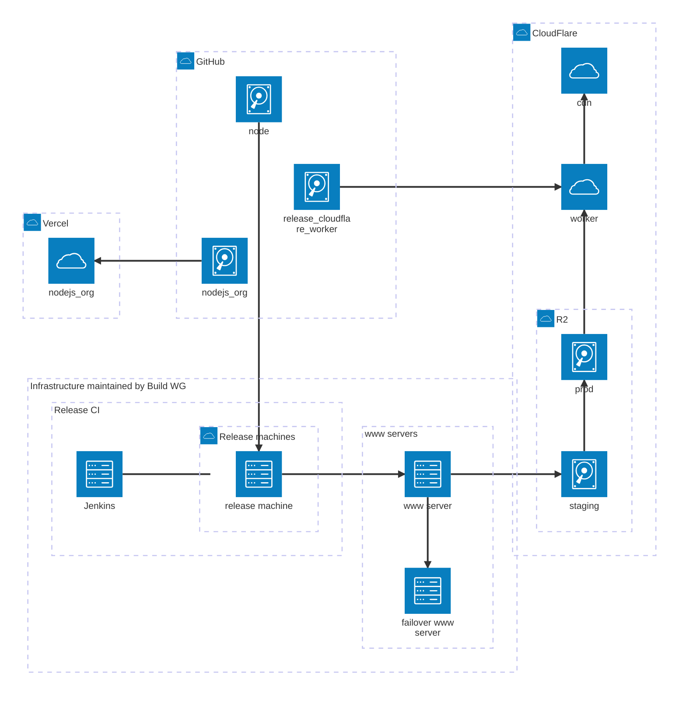

# Overview of release process and infrastructure for Node.js

This is an overview of infrastructure owned/managed by the Build WG and how it interacts with Node.js' [release process][].

## Architecture

This diagram shows the major components of how a Node.js release is built and made publicly available on [nodejs.org][].

## In Detail

Clicking on most labels will take you to the relevant area of the build repository or other repository owned by the Node.js organization.

[nodejs.org]: https://nodejs.org
[release process]: https://github.com/nodejs/node/blob/main/doc/contributing/releases.md
