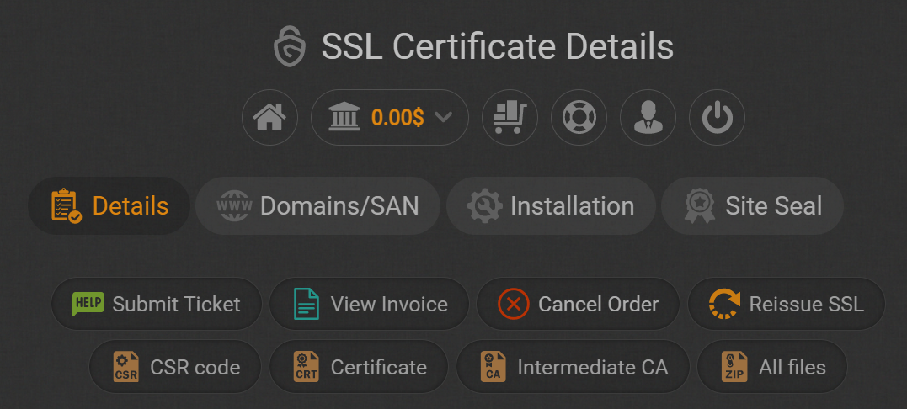

# Replacing the main Node.js TLS/SSL certificate

Node.js' public facing websites are secured by a TLS/SSL wildcard certificate. Currently this is a [multi-year subscription][] obtained via the OpenJS Foundation via [GoGetSSL][]. Certificates are issued for a period of 13 months and will need to be either renewed or reissued on an annual basis.

You will need build-infra level access to be able to retrieve the certificate and update the build infrastructure. Login information for Build WG accounts are in the [secrets repository][] (restricted).

## Places that need to be updated

* [Cloudflare](#updating-cloudflare)
* [Nginx web servers](#updating-nginx-servers)
  * ci ([ci.nodejs.org][])
  * ci-release ([ci-release.nodejs.org][])
  * unencrypted ([unencrypted.nodejs.org][])
  * www ([nodejs.org][])
* [Secrets repository](#update-copy-of-certificate-and-key-in-secrets)

## New or reissue certificate

GoGetSSL should send notifications to the Build WG email address from 30 days before the existing certificate expires. If we are within the multi-year subscription period, we can [reissue the certificate](#reissue-certificate), otherwise a new ceriticate will need to be purchased via a request to the OpenJS Foundation. 

### Generating new certificate and key

Create a new key each time you renew the certificate. 

Currently we use RSA, 4096 bits (validate on each renewal that this is still the recommended/reasonable values).

In the `/root/tmp` directory, create the key with the following command on the www server:
```
openssl genrsa -out star_nodejs_org.key 4096
```

Generate a CSR request with the following command
```
openssl req -new -key star_nodejs_org.key -out star_nodejs_org_chained.csr
```
and provide the following info when prompted:

key | value
---|---
Country Name | US
State or Province Name | California
Locality | San Francisco
Organization Name | OpenJS Foundation
Organizational Unit Name | Node.js
Common Name | *.nodejs.org

Go to https://my.gogetssl.com and choose `SSL Certificates` -> (The new certificate) -> `View` -> `Generate Certificate` and paste the CSR into the box provided.

### Reissue certificate

Go to https://my.gogetssl.com and choose `SSL Certificates` -> (The expiring certificate) -> `View` -> `Reissue SSL`. The CSR should already be filled in the box provided.

### Validation

When asked to choose a validation approach, use DNS validation. This requires logging into Cloudflare and creating a CNAME entry. The process warns that this can take 10 minutes to 24 hours, although it took only a few minutes the previous time the certificate was renewed. Once the CNAME entry is created you will get an email with the certificate.

## Download certificate

The certificate can either be downloaded from the web UI or from one of the confirmation emails sent by GoGetSSL.

### Download certificate via the web UI

If downloading via the web UI some assembly will be required to construct the `star_nodejs_org_chained.crt` file.

Go to https://my.gogetssl.com and then choose `SSL Certificates`->(The new certificate) -> `View`.

 
 You will either need to download the files from either:
 * Both `Certificate` and `Intermediate CA`. Paste the contents of both files into `/root/tmp/star_nodejs_org_chained.crt`.
 * Download `All files`. This will be a `.zip` file containing three files. Paste the contents of all three unzipped files into `/root/tmp/star_nodejs_org_chained.crt`.
  
### Certificate from confirmation email

As part of the renewal/reissue process we will get two emails:
* One email is sent to `build` email alias. This will only contain one certificate (the equivalent of `Certificate` from the web UI). Do not use this on its own -- if you do want to use this you will need to combine it with the `Intermediate CA` from the web UI).
* One email is sent to the `accounts` email alias. This will have subject `New SSL Certificate [GOGETSSL] ORDERID: <id>` and contain three encoded blocks starting `-----BEGIN CERTIFICATE-----` and ending `-----END CERTIFICATE-----`. Copy all three blocks into `/root/tmp/star_nodejs_org_chained.crt`.

### Check `/root/tmp/star_nodejs_org_chained.crt`

Open `/root/tmp/star_nodejs_org_chained.crt` in a text editor. There should be three encoded blocks starting `-----BEGIN CERTIFICATE-----` and ending `-----END CERTIFICATE-----`. If there is only one block you will need to go back and reconstruct the file using one of the options above.

## Updating Cloudflare

Upload under `nodejs.org` -> `SSL/TLS` -> `Edge Certificates` menu, expand the entry for `*.nodejs.org, nodejs.org` and then select the wrench. This should bring up the `Replace SSL certificate and key` dialog. Copy in the certificate and key.

Use the following options for the drop downs on the page
Option | Value
---|---
Private Key Restrictions | Distribute to all Cloudflare data centers
Legacy Client Support | Legacy

And then select `Upload Custom Certificate`.

Validate that the `Expires on` for the entry now shows the updated expiry date.  It make take some time for the update to propagate across the Cloudflare servers.

## Updating nginx servers

For each webserver, the certificate is installed into `/etc/nginx/ssl`. The following steps use `unencrypted` as an example:

Upload the certificate and key to the server.
```
ssh unencrypted mkdir /root/tmp
scp star_nodejs_org.key star_nodejs_org_chained.crt unencrypted:/root/tmp/
```

Open an ssh session on the server, backup the existing keys and then copy over the new ones
```
ssh unencrypted
cd /etc/nginx/ssl/
cp nodejs_chained.crt nodejs_chained.crt.old
cp nodejs.key nodejs.key.old
cp /root/tmp/star_nodejs_org_chained.crt nodejs_chained.crt
cp /root/tmp/star_nodejs_org.key nodejs.key
```

Restart nginx
```
systemctl restart nginx
```

Use a web browser to go to the server (e.g. https://unencrypted.nodejs.org (make sure you go to the https URL and not http)) and use the browser to view the certificate and expiry to check it matches the new expected validity dates.

Delete `/root/tmp` on the server

## Update copy of certificate and key in secrets

Encrypt the key and certificate. We generally DO NOT fork projects in the nodejs-private organization. Instead we clone the [secrets repository][] directly from nodejs-private and create a new branch in that private repo.

From where you have temporarily stored the certificates/key and assuming you have checked out the secrets repo at ~/secrets and have created a new branch. 

```
cat star_nodejs_org_chained.crt | dotgpg create ~/secrets/build/infra/star_nodejs_org_chained.crt
```

```
cat star_nodejs_org.key | dotgpg create ~/secrets/build/infra/star_nodejs_org.key
```

Validate that both are encrypted by looking at:

```
cat ~/secrets/build/infra/star_nodejs_org.key
```

and

```
cat ~/secrets/build/infra/star_nodejs_org_chained.crt
```

The should have similar footers/trailers to the existing content of https://github.com/nodejs-private/secrets/blob/master/build/infra/star_nodejs_org_chained.crt with the middle content being the encrypted part.

Decrypt the new files with 

```
dotgpg cat ~/secrets/build/infra/star_nodejs_org.key
```

and

```
dotgpg cat ~/secrets/build/infra/star_nodejs_org_chained.crt
```

and compare against the original files you had encrypted.

Add the new files in git and commit. 
Push your branch in nodejs-private and then create a pull request.

Delete any local copies of the non-encrypted key/certificate files

[GoGetSSL]: https://www.gogetssl.com/
[ci-release.nodejs.org]: https://ci-release.nodejs.org
[ci.nodejs.org]: https://ci.nodejs.org
[multi-year subscription]: https://www.gogetssl.com/wiki/general/multi-year-subscription-ssl/
[nodejs.org]: https://nodejs.org
[secrets repository]: https://github.com/nodejs-private/secrets
[unencrypted.nodejs.org]: https://unencrypted.nodejs.org
